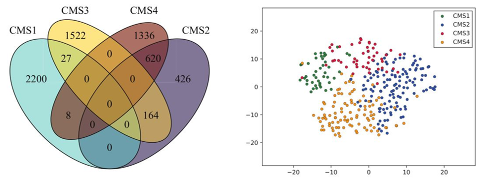

# MONTI: A Multi-Omics Non-negative Tensor decomposition framework for the Integrated analysis of large cancer cohorts

Multi-omics data is frequently measured to characterize biological mechanisms underlying phenotypes. Complex relationships in multi-omics data, if mined, can lead to more accurate classification of patient samples according to the phenotypes.

MONTI (Multi-Omics Non-negative Tensor decomposition for Integrative analysis) is a tool that can be used to integrate and analyze large sets of multi-omics data. MONTI identifies gene regulatory multi-omics features specific to a group of samples that share a common biological trait.

Below is an illustration of the analysis workflow of MONTI.


The output of MONTI is a simple gene list with information of their associated subtypes, which can be used for further downstream analysis. For example, the Venn diagram below shows the genes that are found to be associated to colorectal cancer subtypes CMS1, CMS2, CMS3 and CMS4. These genes showed to be informative in separating the four subtypes as shown in the t-SNE plot.
<!---->


---

# MONTI v1.0
# Python version>=3.6 is required to run MONTI

## Installing MONTI
```bash
	$ sudo python install_monti.py
```
## Running MONTI
```bash
	usage: monti.py [-h] -f INPUT_FILE -r RANK -s SAMPLE_INFO
		[-surv SURVIVAL_INFO] [-o OUTDIR] [--plot]
		[--dmax_iter DMAX_ITER] [--alpha ALPHA]
		[-pre PREPROCESS_DIR]

	# mandatory arguements
	-f : the input tensor data (a numpy ndarray)
	-r : the number of ranks that the tensor is to be decomposed with
	-s : a two column text file that contains sample IDs and its associated breast cancer subtype
	-surv: a trhee column text file that contains sample IDs, survival state, time

	# optional arguements
	-o: the output directory name (default: 'output')
	-pre: the directory of rawdata that need to be pre-processed (log2, quantile normalized, scaled and tensor merged)
	--plot: indicator for drawing gene plots
	--damx_iter: the number of maximum iterations during tensor decomposition (default: 300)
	--alpha: the L1 penalty weight (default: 0.01)
```

## Reproducing results in the paper

Due to the nature of selecting features include some randomness (repeated 10-fold cross validation, random splitting of test and train samples), the results from our study cannot be completely reproduced. However, the variance should not be significant.

Please follow the instructions below.
1. Installing MONTI	(uncompress files & install required modules)
```bash
	tar -xzvf monti_v1.3.tar.gz
	sudo python3 install_monti.py.
```

2. Execute MONTI using the previously decomposed components
```bash
	python3 monti.py -f inputdata/tensor_BRCA_log2_qnormalized_scaled.npy -r 450 -s inputdata/sample_info.txt -surv inputdata/patient_info.txt --plot -o output_paper
```

3. The following result files can be found under the "output_paper" directory
	> sample_features_r450.txt: the breast cancer subtype associated patient features
	> feature_genes_r450.txt: the feature associated genes
	> accuracy_patients_r450.txt: the classification accuracy using patient features
	> accuracy_genes_r450.txt: the classification accuracy using feature genes
	> survival_patients_plot.pdf: survival plots using patient features
	> survival_genes_plot.pdf: survival plots using feature genes
	> patient_models/: the MLP classification models generated using the patient features
	> gene_models//: the MLP classification models generated using the gene features
	> plots/: 
		> gene_plots_<subtype>.pdf: multi-omics scatter plot of the <subtype> associated genes
		> sample_tSNE.pdf: the t-SNE plot using patient features


---

## Using the STAD data

### Generate input data for MONTI
```bash
monti_input_dir="dataset/STAD/inputdata"
bin/samp_to_mat.py -i dataset/STAD/data/omics_STAD_gene_genecentric.csv dataset/STAD/data/omics_STAD_meth450_genecentric.csv dataset/STAD/data/omics_STAD_mirna_genecentric.csv -s dataset/STAD/subtype_info.txt -r subtype -g dataset/gene_info_withheader.txt -o $monti_input_dir
```

### running MONTI
```bash
rank=150	# number of ranks (features)
monti_outputdir="dataset/STAD/output"
bin/monti.py -f $monti_input_dir/tensor.subtype.npy -s $monti_input_dir/sampinfo_subtype.txt -g $monti_input_dir/geneinfo_subtype.txt -r $rank -o $monti_outputdir --plot
```

## Using the COAD data

### Generate input data for MONTI
``` bash
monti_input_dir="dataset/COAD/inputdata"
bin/samp_to_mat.py -i dataset/COAD/data/omics_COAD_gene_genecentric.csv dataset/COAD/data/omics_COAD_meth450_genecentric.csv dataset/COAD/data/omics_COAD_mirna_genecentric.csv -s dataset/COAD/data/subtype_info.txt -r subtype -g dataset/gene_info_withheader.txt  -o $monti_input_dir
```

### running MONTI
``` bash
rank=150
monti_outputdir="dataset/COAD/output"
bin/monti.py -f $monti_input_dir/tensor.subtype.npy -s $monti_input_dir/sampinfo_subtype.txt -g $monti_input_dir/geneinfo_subtype.txt -r $rank -o $monti_outputdir --plot
```
